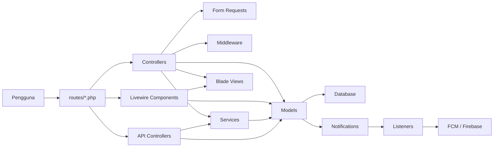

# Graphify: `lr_pasti`

Ringkasan visual untuk folder semasa (`.`) berdasarkan struktur repo Laravel ini.

## Peta Struktur

```mermaid
graph TD
    ROOT["lr_pasti/"]

    ROOT --> APP["app/"]
    ROOT --> ROUTES["routes/"]
    ROOT --> RES["resources/"]
    ROOT --> CONFIG["config/"]
    ROOT --> DB["database/"]
    ROOT --> PUBLIC["public/"]
    ROOT --> TESTS["tests/"]
    ROOT --> DOCS["docs/"]

    APP --> CTRL["Http/Controllers"]
    APP --> MW["Http/Middleware"]
    APP --> REQ["Http/Requests"]
    APP --> LIVE["Livewire"]
    APP --> MODELS["Models"]
    APP --> SERVICES["Services"]
    APP --> NOTIF["Notifications"]
    APP --> LISTENERS["Listeners"]
    APP --> SUPPORT["Support"]
    APP --> VIEWCOMP["View/Components"]
    APP --> CONSOLE["Console/Commands"]

    ROUTES --> WEB["web.php"]
    ROUTES --> API["api.php"]
    ROUTES --> AUTH["auth.php"]
    ROUTES --> AI["ai.php"]
    ROUTES --> RCONSOLE["console.php"]

    RES --> CSS["css/app.css"]
    RES --> JS["js/app.js"]
    RES --> BLADE["views/"]

    BLADE --> LAYOUTS["layouts/"]
    BLADE --> AUTHV["auth/"]
    BLADE --> MODULES["modul-modul operasi"]
    BLADE --> LWV["livewire/"]

    DB --> MIG["migrations/"]
    DB --> FACT["factories/"]
    DB --> SEED["seeders/"]

    PUBLIC --> BUILD["build/"]
    PUBLIC --> IMAGES["images/"]
    PUBLIC --> UPLOADS["uploads/"]

    DOCS --> SPECS["superpowers/specs/"]
    DOCS --> PLANS["superpowers/plans/"]
```

## Peta Aliran Aplikasi

## Modul Utama Yang Kelihatan

- Pengurusan pengguna dan profil: `AdminUserController`, `ProfileController`, `User`, `Guru`
- Operasi PASTI: `PastiController`, `PastiInformationController`, `PastiReportController`
- Program dan penyertaan: `ProgramController`, `ProgramParticipationController`, `ProgramStatusController`
- Kewangan dan tuntutan: `FinancialController`, `ClaimController`, `GuruSalaryInformationController`
- Komunikasi dan notifikasi: `AdminMessageController`, `NotificationController`, `FcmNotificationService`
- Integrasi luaran: `N8nSettingController`, `N8nWebhookService`, API controller berkaitan `n8n`
- Penilaian dan KPI: `PemarkahanController`, `KpiController`, `KpiCalculationService`, `RecalculateKpiSnapshots`

## Nota Ringkas

- Ini ialah aplikasi Laravel dengan gabungan `Blade`, `Livewire`, dan aset `Vite`.
- Folder `resources/views/` memegang banyak modul domain, menunjukkan aplikasi ini berorientasikan operasi dalaman.
- Notifikasi bergerak melalui model/notifikasi/listener dan disambungkan ke Firebase FCM.
- Kehadiran `routes/ai.php` dan `config/mcp.php` menunjukkan ada integrasi AI/MCP dalam repo ini.
