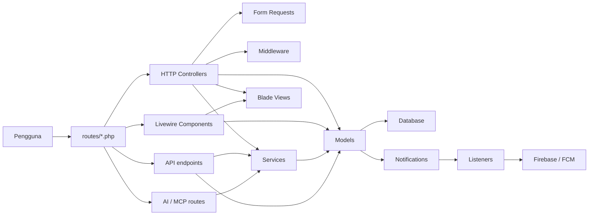

# Graphify: `lr_pasti`

Ringkasan visual untuk folder semasa (`.`) berdasarkan struktur repo Laravel yang aktif pada 1 Mei 2026.

## Peta Struktur Repo

```mermaid
graph TD
    ROOT["lr_pasti/"]

    ROOT --> APP["app/"]
    ROOT --> ROUTES["routes/"]
    ROOT --> RES["resources/"]
    ROOT --> CONFIG["config/"]
    ROOT --> DB["database/"]
    ROOT --> PUBLIC["public/"]
    ROOT --> TESTS["tests/"]
    ROOT --> DOCS["docs/"]

    APP --> HTTP["Http/"]
    APP --> LIVE["Livewire/"]
    APP --> MODELS["Models/"]
    APP --> SERVICES["Services/"]
    APP --> NOTIF["Notifications/"]
    APP --> LISTENERS["Listeners/"]
    APP --> SUPPORT["Support/"]
    APP --> PROVIDERS["Providers/"]
    APP --> CONSOLE["Console/"]
    APP --> VIEWCOMP["View/"]

    HTTP --> CTRL["Controllers/"]
    CTRL --> APICTRL["Api/"]
    CTRL --> AUTHCTRL["Auth/"]
    HTTP --> MW["Middleware/"]
    HTTP --> REQ["Requests/"]

    ROUTES --> WEB["web.php"]
    ROUTES --> API["api.php"]
    ROUTES --> AUTH["auth.php"]
    ROUTES --> AI["ai.php"]
    ROUTES --> CLI["console.php"]

    RES --> CSS["css/app.css"]
    RES --> JS["js/app.js"]
    RES --> VIEWS["views/"]

    VIEWS --> LAYOUTS["layouts/"]
    VIEWS --> AUTHV["auth/"]
    VIEWS --> COMPONENTS["components/"]
    VIEWS --> LIVEV["livewire/"]
    VIEWS --> OPS["modul operasi domain"]

    DB --> MIG["migrations/"]
    DB --> FACT["factories/"]
    DB --> SEED["seeders/"]

    PUBLIC --> BUILD["build/"]
    PUBLIC --> IMAGES["images/"]
    PUBLIC --> UPLOADS["uploads/"]

    DOCS --> GRAPH["graphify-lr-pasti.md"]
    DOCS --> SUPER["superpowers/"]
```

## Peta Domain UI

```mermaid
graph TD
    VIEWS["resources/views/"] --> ADMIN["admin-users/"]
    VIEWS --> AJK["ajk-program/"]
    VIEWS --> ANN["announcements/"]
    VIEWS --> CLAIMS["claims/"]
    VIEWS --> DIRFILES["directory-files/"]
    VIEWS --> FIN["financial/"]
    VIEWS --> GDIR["guru-directory/"]
    VIEWS --> GURU["gurus/"]
    VIEWS --> GCOURSE["guru-course/"]
    VIEWS --> GSALARY["guru-salary-information/"]
    VIEWS --> KAWASAN["kawasan/"]
    VIEWS --> KELAS["kelas/"]
    VIEWS --> KPI["kpi/"]
    VIEWS --> LEAVE["leave-notices/"]
    VIEWS --> MSG["messages/"]
    VIEWS --> MCP["mcp/"]
    VIEWS --> N8N["n8n-settings/"]
    VIEWS --> PASTI["pasti/"]
    VIEWS --> PASTIINFO["pasti-information/"]
    VIEWS --> PREPORT["pasti-reports/"]
    VIEWS --> PMARK["pemarkahan/"]
    VIEWS --> PROFILE["profile/"]
    VIEWS --> PROGRAM["programs/"]
    VIEWS --> PSTAT["program-statuses/"]
    VIEWS --> STATIC["privacy-policy.blade.php"]
    VIEWS --> HOME["welcome.blade.php"]
```

## Peta Aliran Aplikasi

## Modul Utama Yang Dapat Dikenal Pasti

- Pengurusan pengguna dan akses: `AdminUserController`, `ProfileController`, `ImpersonationController`, model `User`
- Operasi guru dan kelas: `GuruController`, `GuruCourseController`, `GuruSalaryInformationController`, `KelasController`, model `Guru`, `Kelas`
- Operasi PASTI: `PastiController`, `PastiInformationController`, `PastiReportController`, model `Pasti`, `PastiInformationRequest`
- Program dan penyertaan: `ProgramController`, `ProgramParticipationController`, `ProgramStatusController`, `AjkProgramController`
- Kewangan dan tuntutan: `FinancialController`, `ClaimController`, model `FinancialTransaction`, `Claim`, `GuruSalaryRequest`
- Direktori dan fail: `DirectoryFileController`, model `DirectoryFile`, paparan `resources/views/directory-files/` dan `resources/views/guru-directory/`
- Penilaian dan KPI: `PemarkahanController`, `KpiController`, `KpiCalculationService`, model `KpiSnapshot`, `PastiScore`
- Komunikasi dan notifikasi: `AdminMessageController`, `AnnouncementController`, `NotificationController`, `FcmNotificationService`
- Integrasi luaran dan automasi: `N8nSettingController`, `N8nWebhookService`, `FirebaseAccessTokenService`, konfigurasi `config/mcp.php`

## Ringkasan Pemerhatian

- Aplikasi ini ialah projek Laravel berasaskan `Blade`, dengan `Livewire` untuk komponen interaktif dan `Vite` untuk binaan aset hadapan.
- Struktur `resources/views/` menunjukkan repo ini disusun mengikut domain operasi dalaman, bukan sekadar lapisan teknikal.
- Folder `app/Http/Controllers/` dibahagi lagi kepada aliran web biasa, API mudah alih, dan auth bawaan Laravel.
- Laluan `routes/ai.php` bersama paparan `resources/views/mcp/` dan konfigurasi `config/mcp.php` menunjukkan ada integrasi AI atau MCP yang aktif.
- Sistem notifikasi nampak bergerak melalui model token, notifikasi, listener, dan servis Firebase/FCM.
